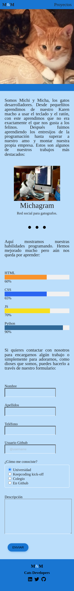

# M&M Portfolio

Este proyecto es el portfolio de los trabajos de los gatos desarrolladores, Michi y Micha, pioneros en su campo.

## Instrucciones de Instalación

1. Navegar a la pagina de GitHub y clonar el repositorio.

```
 git clone https://github.com/ReyesMorales/PortfolioHTML
```

2. Utiliza live server (u otro semejante) para visitar el localhost y ver el contenido del portfolio.

   ...
## Tecnologías Utilizadas

- HTML
- CSS

## Vista previa

Version movil




