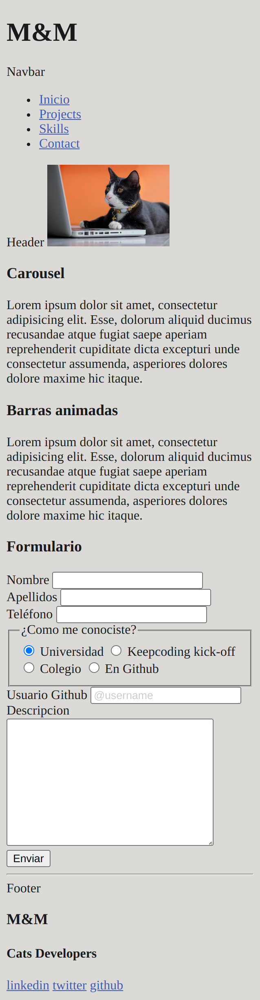

# M&M Portfolio

Este proyecto es el portfolio de los trabajos de los gatos desarrolladores, Michi y Micha, pioneros en su campo.

## Instrucciones de Instalación

1. Navegar a la pagina de GitHub y clonar el repositorio.

```
 git clone https://github.com/ReyesMorales/PortfolioHTML
```

2. Utiliza live server (u otro semejante) para visitar el localhost y ver el contenido del portfolio.

   ...

## Estructura de Archivos

Explicación de la estructura de archivos del proyecto:

/
├── index.html
├── styles.css
├── script.js
├── images/
│ ├── image1.jpg
│ ├── image2.jpg
│ └── ...
└── ...


## Tecnologías Utilizadas

- HTML
- CSS

## Vista previa

Version movil



## Ejemplos de Código Destacados

```html
<!-- Código HTML destacado -->
<div class="example">
  ...
</div>

/* Código CSS destacado */
.example {
  ...
}


Contacto
Email: reyesmoralesdominguez@gmail.com
GitHub: https://github.com/ReyesMorales
